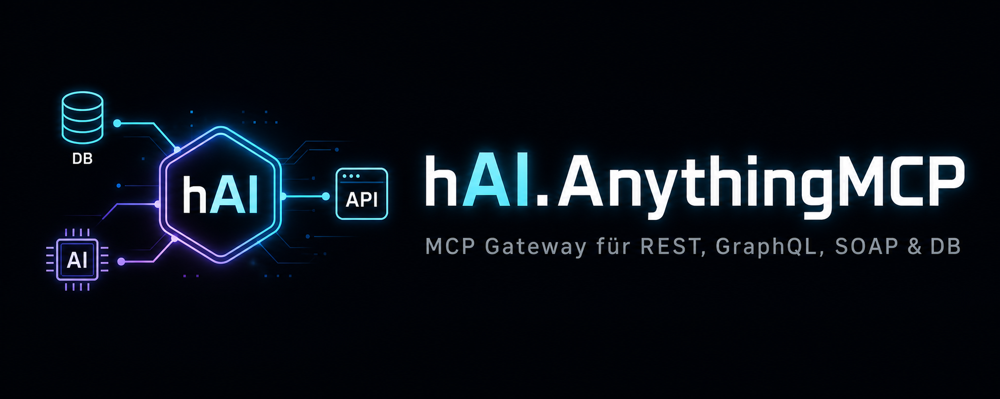

<div align="center">



# hAI.AnythingMCP

**Self-hosted AnythingMCP Gateway** — läuft als Portainer Stack im `highfishNetwork`
Basiert auf [HelpCode-ai/anythingmcp](https://github.com/HelpCode-ai/anythingmcp) · wandelt REST, SOAP, GraphQL & Datenbanken in MCP-Tools für Claude, ChatGPT, Gemini & Co. um

[](https://github.com/HelpCode-ai/anythingmcp)
[](https://hub.docker.com/r/helpcodeai/anythingmcp)
[](https://github.com/HelpCode-ai/anythingmcp/blob/main/LICENSE)
[](https://www.portainer.io/)
[]()
[]()
[]()

</div>

---

## 📋 Inhaltsverzeichnis

- [Was ist AnythingMCP?](#was-ist-anythingmcp)
- [Features](#features)
- [Voraussetzungen](#voraussetzungen)
- [Schnellstart (Portainer Stack)](#schnellstart-portainer-stack)
- [Umgebungsvariablen](#umgebungsvariablen)
- [Services & Ports](#services--ports)
- [Netzwerk](#netzwerk)
- [Hinweise & Sicherheit](#hinweise--sicherheit)
- [Upstream & Lizenz](#upstream--lizenz)

---

## Was ist AnythingMCP?

AnythingMCP ist ein selbst-gehostetes, KI-gestütztes **MCP-Gateway**. Es wandelt bestehende APIs und Datenbanken in [Model Context Protocol](https://modelcontextprotocol.io/) Tools um – ohne Code schreiben zu müssen.

- **REST, SOAP, GraphQL, SQL/NoSQL → MCP Tools**
- **175+ vorgefertigte Adapter** (Deutsche Bahn, DHL, weclapp, Shopware ...)
- **Kompatibel mit:** Claude, ChatGPT, Gemini, Copilot, Cursor
- **Voll self-hosted** – Credentials bleiben auf deiner Infrastruktur (AES-256-GCM)

---

## Features

| Feature | Details |
|---|---|
| 🔌 Connector-Typen | REST, SOAP/WSDL, GraphQL, Database, MCP-Bridge |
| 📥 Import-Formate | OpenAPI/Swagger, Postman, cURL, WSDL, GraphQL introspection |
| 🧩 Adapter | 175+ vorgefertigte (Deutsche Bahn, DHL, Etsy, Shopware …) |
| 🔐 Auth | OAuth2, Bearer, API Key, Basic, WS-Security, OAuth 1.0a |
| 📋 Audit Log | Jeder Tool-Call wird protokolliert |
| 👥 RBAC | Rollen & Tool-Whitelisting pro Nutzer |
| 🧠 Knowledge Graph | Beziehungen zwischen Connectors – optional, opt-in |
| 🐳 Docker-ready | `docker compose up` – läuft sofort |

---

## Voraussetzungen

- Docker 24+
- Portainer (Stack-Deployment)
- Externes Netzwerk `highfishNetwork` muss vorhanden sein
- `.env` Datei auf Basis von `.env.example` anlegen

```bash
docker network create highfishNetwork
```

---

## Schnellstart (Portainer Stack)

1. **In Portainer:** `Stacks` → `Add Stack` → `Git Repository`
2. **Repository URL:** `https://github.com/jbkunama1/hAI.AnythingMCP.git`
3. **Repository reference:** `refs/heads/main`
4. **Compose path:** `docker-compose.yml`
5. **Environment-Variablen** eintragen
6. **Deploy Stack**

Nach dem Start:
- Web UI: `http://<deine-ip>:3000`
- MCP Endpoint: `http://<deine-ip>:4000/mcp`
- ⚠️ **Sofort ersten Admin-Account anlegen!**

---

## Umgebungsvariablen

Siehe [`.env.example`](./.env.example) für alle verfügbaren Variablen.

| Variable | Beschreibung | Beispiel |
|---|---|---|
| `AMCP_SECRET` | App-Secret (min. 32 Zeichen) | `openssl rand -hex 32` |
| `AMCP_ADMIN_EMAIL` | Admin-E-Mail | `admin@example.com` |
| `AMCP_PORT_UI` | UI-Port | `3000` |
| `AMCP_PORT_MCP` | MCP-Endpunkt-Port | `4000` |
| `REDIS_URL` | Redis-URL (optional) | `redis://redis:6379` |

---

## Services & Ports

| Service | URL | Beschreibung |
|---|---|---|
| Web UI | `http://localhost:3000` | Verwaltungsoberfläche |
| MCP Endpoint | `http://localhost:4000/mcp` | MCP-Protokoll für AI-Clients |
| Swagger / API Docs | `http://localhost:4000/api/docs` | REST API Dokumentation |

---

## Netzwerk

Dieser Stack nutzt das **externe Docker-Netzwerk `highfishNetwork`**, damit er sich mit anderen Diensten im Stack verbinden kann.

```yaml
networks:
  highfishNetwork:
    external: true
```

Falls das Netzwerk noch nicht existiert:

```bash
docker network create highfishNetwork
```

---

## Hinweise & Sicherheit

- ⚠️ **Erster Start:** Sofort nach dem Start den Admin-Account anlegen. Der erste registrierte User wird automatisch Admin.
- 🔒 Credentials werden AES-256-GCM verschlüsselt gespeichert.
- 📋 Jeder Tool-Call wird im Audit-Log protokolliert.
- 🌐 Port öffentlich erreichbar? Firewall-Regeln setzen oder UI vorerst auf `127.0.0.1` binden.
- 🔑 `AMCP_SECRET` regelmäßig rotieren (`openssl rand -hex 32`).

---

## Upstream & Lizenz

- **Upstream:** [HelpCode-ai/anythingmcp](https://github.com/HelpCode-ai/anythingmcp)
- **Lizenz:** [AGPL-3.0](https://github.com/HelpCode-ai/anythingmcp/blob/main/LICENSE)
- **Maintainer dieses Stacks:** [jbkunama1](https://github.com/jbkunama1) · [realteacher.de](http://www.realteacher.de)

---

> ⭐ Wenn dir AnythingMCP gefällt, gib dem [Upstream-Repo](https://github.com/HelpCode-ai/anythingmcp) einen Star!
